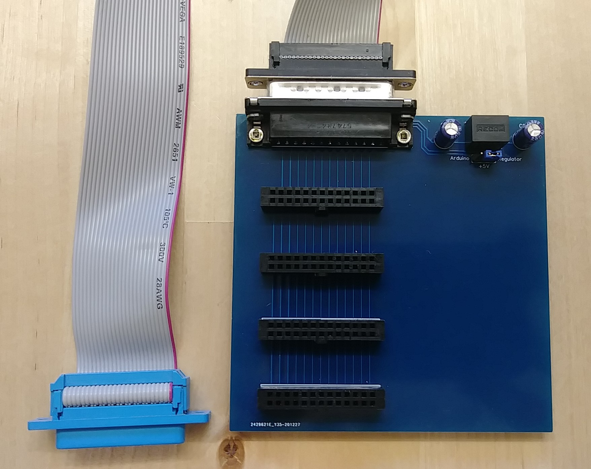

# I/O Bus Backplane

The backplane provides four slots to plug in extension cards.
It also contains a 5V regulator. 

The I/O bus carries the Arduino's 
+5V and +3.3V output voltages which can be used to power the
extension cards. However, some cards (e.g. the 88-PIO parallel 
port) can draw a significant current on the 5V line due to the
older-technology ICs used.

To prevent overloading the Arduino's on-board 5V regulator when
using multiple cards, the backplane has its own 5V regulator
which uses the input voltage switched by the AltairDuino's
power switch.

A jumper setting allows to switch the 5V supply for the cards
between the Arduino's on-board regulator and the 5V regulator
on the backplane. This is useful when the Arduino is powered
directly via the USB port, in which case no RAW voltage is
available and the 5V is directly taken from USB.

As implemented here, the backplane connects to the Arduino
via a DB-25 connector and a 25-wire ribbon cable.

Schematics and PCB as well as a Gerber file for PCB production
are in this directory. The project is also available on EasyEDA:
https://oshwlab.com/hansel72/backplane
