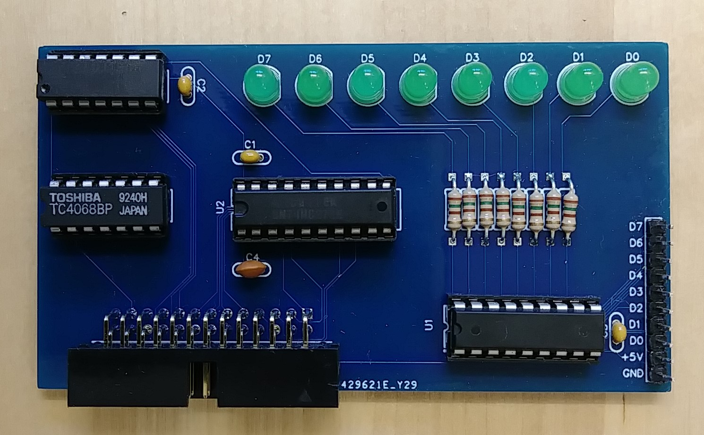

## LED Output Register

One advantage of the IMSAI 8080 over the Altair 8800 was the output
register at address 255 which would display the output value on a 
set of 8 LEDs on the front panel. This allowed for some crude but simple
way of displaying data without needing any other devices.
This simple card reproduces such a register for the Altair.

To output a value to the LEDs in BASIC just execute "OUT 255,x" where
x is a byte value (0-255). The LEDs will display the binary representation
of the given value.

Schematics and PCB as well as a Gerber file for PCB production are in this directory. 
The project is also available on EasyEDA: https://oshwlab.com/hansel72/outputff
