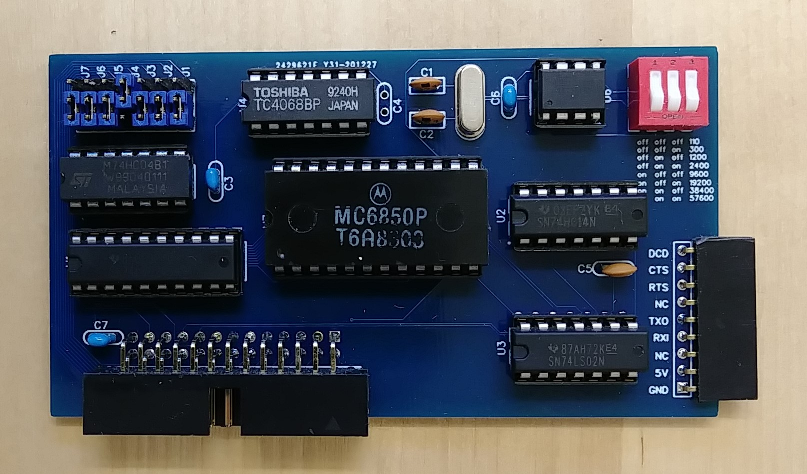

## Serial port (88-2SIO)

The 88-2SIO card for the Altair had two serial ports with RTS/CTS
flow control. This card implements one such serial port. 

Note that the output signals are 5V TTL level signals. To get true
serial level signals they will need to be converted through a MAX232
or similar converter.

This card uses the same IC (Motorola 6850) as the original 88-2SIO
card and therefore is 100% software compatible except that the card
can not cause interrupts in the emulator.

Obviously the Altair Simulator already comes with a serial interface
but this card offers the possibility of adding more serial interfaces
as well as supporting RTS/CTS flow control which can be helpfule when
talking to slow peripherals such as printers.

To keep the chip count down, the serial clock generator on this card is 
implemented using a ATTiny85 microcontroller. Note that the controller is 
driven by a 11.0592MHz crystal (as opposed to the usual 8Mhz or 16Mhz)
which allows for precise serial rates. Program the ATTiny85 with the
clockgen.hex file in this folder and make sure to use the following
fuse settings: LOW=0xFF, HIGH=0x57, EXTENDED=0xFF

Note that the baud rate is set by the DIP switches on the card itself,
not by the software (same as it was with the original 88-2SIO card).
Other parameters (parity/bits/stop bits) are set via software.

Schematics and PCB as well as a Gerber file for PCB production are in this directory. 
The project is also available on EasyEDA: https://oshwlab.com/hansel72/2sio_copy
