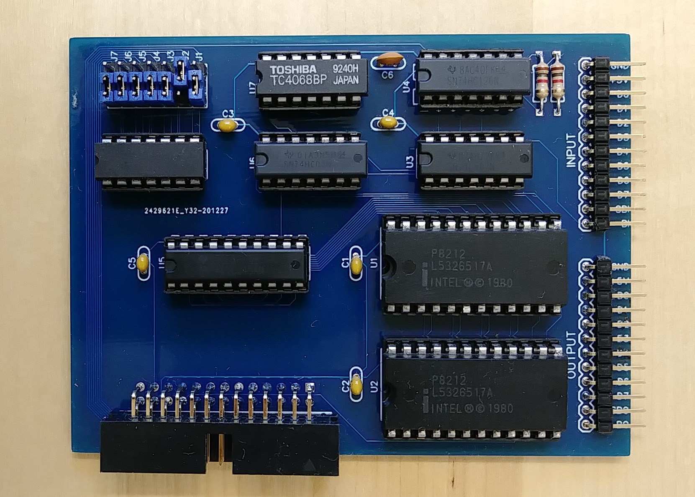

## Parallel port (88-PIO)

The 88-PIO card offered one 8-bit parallel input port and one 
8-bit parallel input port together with handshake signals.
This card uses the same ICs (Motorola 8212) as the 88-PIO card
and therefore is 100% software compatible except that the card
can not cause interrupts in the emulator.

Schematics and PCB as well as a Gerber file for PCB production are in this directory. 
The project is also available on EasyEDA: https://oshwlab.com/hansel72/88-pio
