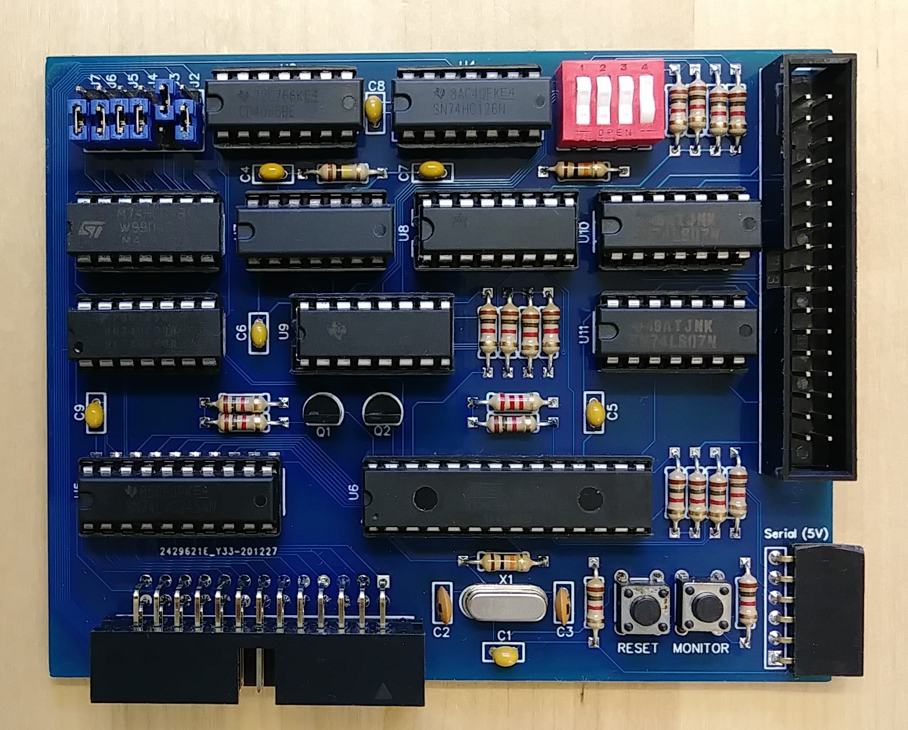

## Disk Controller

This card replicates the function of the MITS 88-DCDD 8-inch 
and 88-MDS (Minidisk) 5.25-inch disk controllers.

It can be connected to a 5.25-inch disk drive and either use
it in double-density mode to replicate the Minidisk system
or in high-density mode to replicate the 8-inch system. Note
that a 5.25-inch disk in high density mode can hold the exact
same amount of data as the original 8-inch disks.

The card can also be connected to a Shugart SA-800 8-inch
disk drive.

Since the interface for 3.5-inch drives is identical to the
5.25-inch drives the card also works with 3.5-inch drives.

To connect the card to one or two drives use a regular PC disk 
drive cable (with the cable twist between the two drive connectors). 

The 4 DIP switches on the card have the following functions:

DIP | Function when on         | Function when off
----|--------------------------|------------------
1   | Act as 88-MDS controller | Act as 88-DCDD controller
2   | Swap drives A and B      | Do not swap drives
3   | Drive B is Shugart SA-800| Drive B is generic 5.25-inch
4   | Drive A is Shugart SA-800| Drive A is generic 5.25-inch

Schematics and PCB as well as a Gerber file for PCB production are in this directory. 
The project is also available on EasyEDA: https://oshwlab.com/hansel72/diskcontrolleruno
