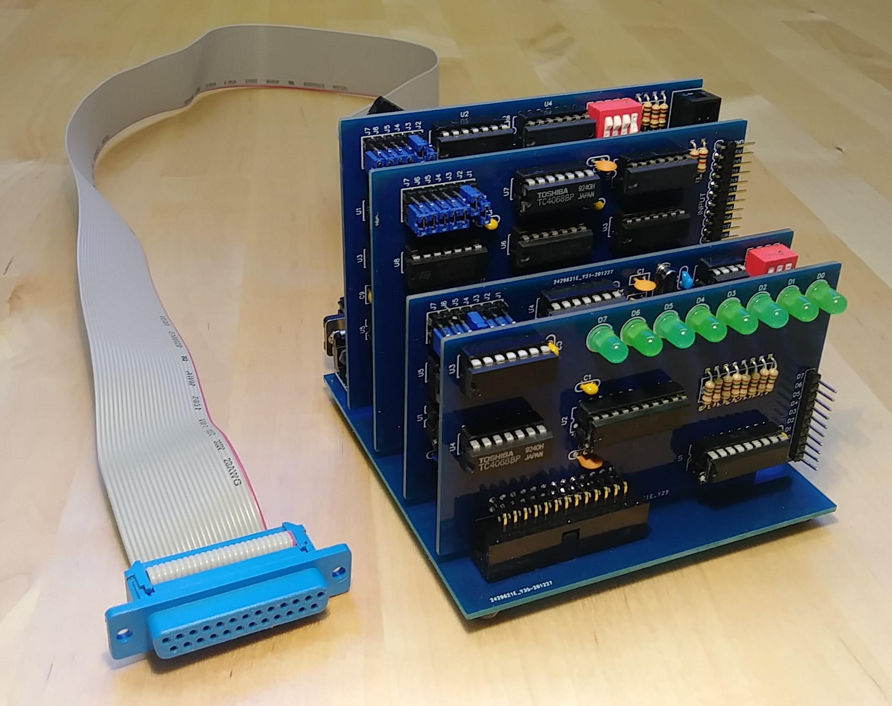

# I/O Bus for Altair 8800 simulator

While thinking about ways to connect more hardware I realized that
the signals that drive the DATA and ADDRESS LEDs, together with a
few control signals (INP, OUT, WAIT) could be used to form a
simple but effective I/O bus.

Such a bus could work very similar to the original S-100 bus and 
allow multiple external devices to be connected and accessed by 
existing emulated software with only minor changes to the emulator 
firmware.

## I/O Bus Basics

When the emulat performs an OUT instruction it sets the A0-7 LEDs
to the output address, sets the D0-7 LEDs to the output data and
then switches the OUT LED on. External hardware connceted to the
bus will see the low->high transition of the OUT signal, can see
whether the proper address is present on A0-7 and if so read the 
data from the D0-7 signals.

When the emulator performs an IN instruction it sets the A0-7 LEDs
to the input address, switches the D0-7 data lines to input mode
and then switches the INP LED on. External hardware will see the
INP signal and can can place the proper data on the D0-7 data lines
for the emulator to read.

In both cases external hardware can pull the WAIT signal high
to indicate that it needs more time to process the IN/OUT
instruction. If so, the emulator will wait until WAIT goes
back low before continuing program execution.

For a more detailed description of the timing and possible 
handshaking see the "Interfacing external hardware" section in 
the [emulator documentation](https://github.com/dhansel/Altair8800/blob/master/Documentation.pdf).

## I/O Bus limitations

While Input/output operations on this bus work very similar to the S-100
bus, there are several significant differences that make it impossible
to connect original S-100 hardware to the bus.  But schematics for
a range of S-100 devices are available and some can re-created to work
with this bus. The main limitations are:

* **No common clock signal.**

  The Arduino Due emulates the instructions executed by
  the Intel 8080 (or Z80) processor but each emulated instruction
  takes a different amount of real time. Furthermore the time for
  each instrution does not match 100% the timing of the original
  processor, i.e. the emulator does not emulate the real 2MHz clock 
  of the Altair. That means that the I/O bus can not provide a 
  clock signal which is required by most S-100 cards for synchronous
  communication between the card and the processor.

  However, using the INP/OUT signals combined with the WAIT signal
  it is possible to communicate asynchronously. For more specific 
  information on how this communication works, see the "Interfacing
  external hardware" section in the documentation.

* **No interrupt signals**

  The I/O bus at this point does not support interrupts. It may be
  possible to add support for interrupts but very little software 
  actually uses interrupts and the effort necessary to support them 
  outhweighs the benefits.

* **No RAM/ROM access**

  The I/O bus works only for INP/OUT instructions. It is not possible
  to intercept memory read/write operations at this point.

## I/O Cards

So far there are four different types of cards that can be plugged
into the I/O bus. Each is described in more detail in a sub-folder
with corresponding name:

- An [LED output register](https://github.com/dhansel/Altair8800/tree/master/IOBus/01-led-output-register) card that provides 8 LEDs at address 255,
  equivalent to the 8-bit output register on the IMSAI-8080

- A [serial port card](https://github.com/dhansel/Altair8800/tree/master/IOBus/02-serial-port) which is equivalent to "half" a 88-2SIO
  card ("half" because it provides only a single serial port)

- A [parallel port](https://github.com/dhansel/Altair8800/tree/master/IOBus/03-parallel-port) equivalent to a 88-PIO card

- A [floppy disk controller](https://github.com/dhansel/Altair8800/tree/master/IOBus/04-disk-controller) equivalent to the 88-DCDD and 88-MD (minidisk)
  controllers that can use regular 5.25" and 3.5" floppy drives as well as Shugart SA-800 8" drives.
  
The cards plug into a [backplane](https://github.com/dhansel/Altair8800/tree/master/IOBus/00-backplane) that connects to the Altair Simulator.

Note that except for the LED output register card (which is hardwired
to address 255) all other cards include jumpers to configure their address.
That allows multiple of the same card to be plugged in at the same time.

## I/O Bus Connections

All signals for the I/O bus can be picked up directly on the
Arduino Due's pins.  For my implementation I connected the
backplane to the Arduino via a 25-pin ribbon cable attached
via a DB-25 connector (see picture below).

Bus Signal | Arduino pin | DB25 Pin
-----------|-------------|------------
D0         | D25         | 1     
D1         | D26         | 2     
D2         | D27         | 3     
D3         | D28         | 4     
D4         | D14         | 5     
D5         | D15         | 6     
D6         | D29         | 7     
D7         | D11         | 8     
A0         | D34         | 14    
A1         | D35         | 15    
A2         | D36         | 16    
A3         | D37         | 17    
A4         | D38         | 18    
A5         | D39         | 19    
A6         | D40         | 20    
A7         | D41         | 21    
OUT        | D6          | 9    
INP        | D8          | 10   
WAIT       | D10         | 11    
RESET      | D52         | 22    
CLR        | D53         | 23    
+3.3V      | +3.3V       | 12      
+5V        | +5V         | 25    
RAW voltage| RAW         | 13    
Ground     | GND         | 24    
